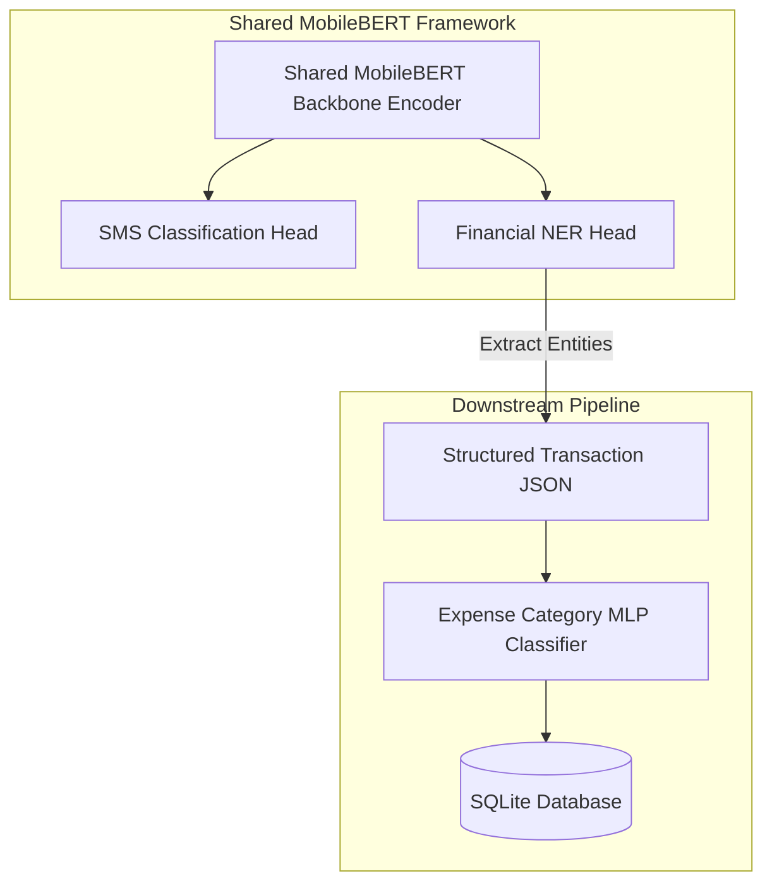

# SpendGuard AI Training Pipeline & Production Architecture

SpendGuard is an enterprise-grade, multi-task AI pipeline built around a shared MobileBERT backbone encoder paired with task-specific heads, lightweight downstream classifiers, automated experiment tracking, and complete production lifecycle management.

## Architecture Overview



## Directory Structure

```text
ai-training/
├── .github/
│   └── workflows/
│       └── validate_project.yml
├── analysis/
│   ├── classification_errors/
│   ├── expense_errors/
│   └── ner_errors/
├── benchmarks/
│   ├── battery/
│   ├── latency/
│   ├── memory/
│   └── storage/
├── checkpoints/
│   ├── classification_head/
│   ├── expense_classifier/
│   ├── ner_head/
│   └── shared_encoder/
├── compatibility/
│   ├── android.json
│   ├── future_web.json
│   └── ios.json
├── configs/
│   ├── classification_labels.json
│   ├── expense_labels.json
│   └── ner_labels.json
├── datasets/
│   ├── processed/
│   ├── raw/
│   ├── snapshots/
│   ├── test/
│   ├── train/
│   ├── validation/
│   └── registry.json
├── evaluation/
│   ├── classification/
│   ├── expense/
│   ├── ner/
│   └── overall/
├── experiments/
│   ├── expense_classifier/
│   ├── shared_mobilebert/
│   ├── experiment_index.json
│   └── model_registry.json
├── exported/
├── integrity/
│   └── checksums.json
├── metadata/
│   ├── distilbert.json
│   ├── expense_classifier.json
│   ├── minilm.json
│   ├── shared_mobilebert.json
│   └── tinybert.json
├── models/
│   ├── v1/
│   ├── v2/
│   ├── v3/
│   └── versions.json
├── releases/
│   ├── v1.0.0/
│   ├── v1.1.0/
│   └── v2.0.0/
├── scripts/
├── training/
│   ├── callbacks/
│   ├── expense_classifier/
│   ├── shared_mobilebert/
│   └── experiment_tracker.py
├── validation/
│   └── validate_project.py
└── deployment_manifest.json
```

## Production Lifecycle & Workflows

### 1. Training & Inference Workflows
- **Training**: Classification and NER heads train independently on `classification.csv` and `validated_ner.json`, updating the shared MobileBERT encoder via joint/mixed batch schedules.
- **Inference**: On-device SMS tokenization happens once -> Classification Head routes `Transaction` SMS -> NER Head extracts 9 financial entities -> Expense MLP predicts category.

### 2. Experiment Lifecycle
Every training session automatically:
1. Reserves next global `EXP_XXXXXX` ID via `experiments/experiment_index.json`.
2. Logs PyTorch/Transformers/Git environment metadata.
3. Records per-epoch loss, metrics, learning rate, and duration into `history.csv`.
4. Saves visualization curves (`loss_curve.png`, `accuracy_curve.png`) and `training_report.md`.
5. Updates `experiments/model_registry.json` when new high scores are achieved.

### 3. Release & Deployment Lifecycle
- **Releases**: Managed under `releases/vX.Y.Z/` with `release_notes.md` and `deployment_manifest.json`.
- **Target Compatibility**: Detailed in `compatibility/android.json`, `ios.json`, and `future_web.json`.
- **Deployment Manifest (`deployment_manifest.json`)**: Points to active release checkpoints, target format (TFLite/ONNX), and minimum SDK constraints.

### 4. Validation Workflow
Run the automated project validator to verify 25 key infrastructure, config, registry, and label requirements:
```bash
python validation/validate_project.py
```

### 5. Future Roadmap
- **Phase 1**: Execute AI training phase for Shared MobileBERT & Expense Classifier.
- **Phase 2**: Quantize checkpoints into TFLite format (`.tflite`) with INT8 precision.
- **Phase 3**: Integrate TFLite models into React Native SpendGuard app via native C++ JNI bridge.
