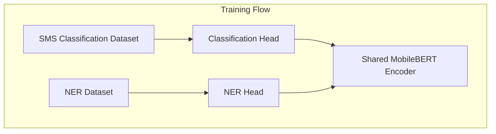
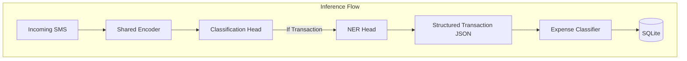

# Shared MobileBERT Architecture & Refined Pipeline

This folder contains the refined multi-task PyTorch architecture that shares a single MobileBERT encoder across both SMS Classification and Financial NER.

## Training Architecture vs. Inference Architecture

### Training Architecture (Independent Dataset Flow)
During training, the Classification Head and NER Head receive batches from two completely independent datasets (`classification.csv` and `validated_ner.json`). The two heads update the **SAME shared MobileBERT encoder** independently. NER does NOT depend on Classification prediction during training.

### Inference Architecture (Sequential Routing Flow)
During inference on device, the SMS passes through the shared encoder. If classified as a `Transaction`, execution proceeds to the NER Head to extract entities, forming a structured JSON for the Expense Classifier.

## Checkpoint System & Callbacks
Checkpoints are saved independently for each modular block in `checkpoints/`:
- `checkpoints/shared_encoder/`
- `checkpoints/classification_head/`
- `checkpoints/ner_head/`
- `checkpoints/expense_classifier/`

Each checkpoint dictionary stores `model_state_dict`, `optimizer_state_dict`, `scheduler_state_dict`, `epoch`, `best_metric`, `training_config`, and `timestamp`, saving both `latest.pt` and `best.pt`.

Callbacks available in `training/callbacks/`:
- `EarlyStopping`: Halts training when loss plateaus.
- `ModelCheckpoint`: Saves `latest.pt` and `best.pt`.
- `TensorBoardLogger`: Logs training & evaluation metrics.
- `LearningRateMonitor`: Tracks optimizer learning rates.

## Configuration & Labels
- All parameters (learning rate, batch size, warmup, dropout, weight decay, early stopping patience, gradient clipping, random seed) are defined in YAML configs (`shared_mobilebert.yaml`).
- All label taxonomies are dynamically loaded from JSON files (`configs/classification_labels.json`, `configs/ner_labels.json`).
